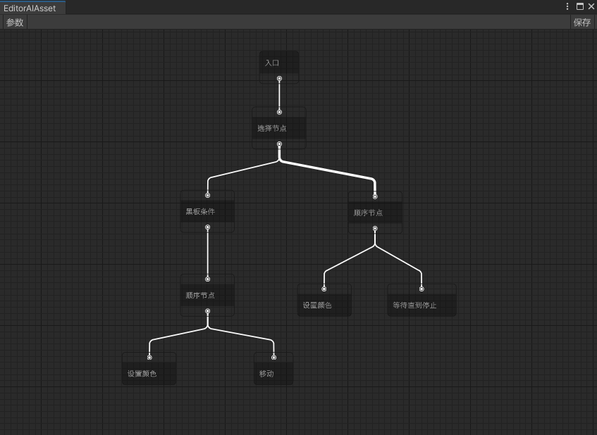
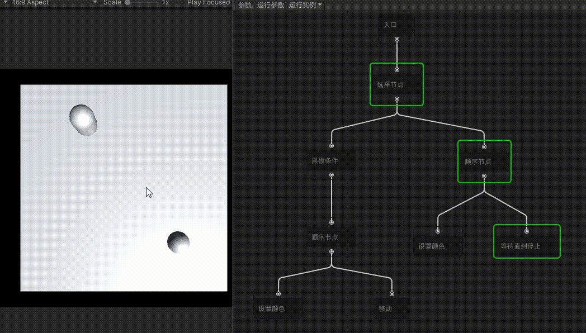

# Emilia-BehaviorTree

Emilia-BehaviorTree是基于[Emilia-NodeEditor](https://github.com/CCEMT/Emilia-NodeEditor)与[NPbehavior](https://github.com/meniku/NPBehave)实现的Unity行为树节点编辑器

## 特点

NPbehavior实现  
运行时和编辑器分离  
可视化调试  
热重载  

## 安装

Unity版本：2021.3+  
Odin版本：3.1.2+  

### Odin为付费插件请自行导入

### 使用unitypackage安装  

在Tag界面中选择对应版本  [Tag界面](https://github.com/CCEMT/Emilia-BehaviorTree/tags)  
找到.unitypackage文件进行下载  
导入Unity之后在PackageManager界面中安装Editor Coroutines  

### 使用Unity Package Manager安装  

打开Packages/manifest.json

将以下内容添加进manifest文件中

~~~json
"com.emilia.kit": "https://github.com/CCEMT/Emilia-Kit.git?path=Assets/Emilia/Kit",
"com.emilia.node.editor": "https://github.com/CCEMT/Emilia-NodeEditor.git?path=Assets/Emilia/Node.Editor",
"com.emilia.behaviortree": "https://github.com/CCEMT/Emilia-BehaviorTree.git?path=Assets/Emilia/BehaviorTree"
~~~

## 例子

基于Emilia-BehaviorTree 实现的AI行为树编辑器 [AI]

## 开始

以下为例子中的实现

### 创建编辑器文件

~~~csharp
[CreateAssetMenu(menuName = "Emilia/AI/EditorAIAsset", fileName = "EditorAIAsset")]
public class EditorAIAsset : EditorBehaviorTreeAsset
{
    public override string outputPath => "Assets/Emilia/AI/Resource/Config";

    public override List<string[]> tags => new List<string[]>() {
        new[] {BaseDefine.NodeTag},
        new[] {UniversalDefine.NodeTag},
        new[] {AIDefine.NodeTag}
    };
}
~~~

outputFilePath：运行时文件最终保存的路径  
tags：根据tag来过滤创建节点时的菜单，上面例子吧三个tag写到了三个不同的list中表示的是，如果这三个tag拥有任何一个tag的节点就可以显示在菜单中；  
如果是三个tag写到了同一个list中（例：new[] {BaseDefine.NodeTag, UniversalDefine.NodeTag, AIDefine.NodeTag}）表示的是，必须同时拥有这三个tag的节点才可以显示在菜单中

## 创建节点基类

~~~csharp
//创建AI的Task类型节点的基类
[NodeTag(AIDefine.NodeTag)]//在基类添加一个tag
public abstract class AITaskAsset<T> : BaseTaskAsset<T> where T : BehaviorTree.Node, new() { }

public abstract class AITask<T> : BaseTask<T> where T : NodeAsset { }
~~~

## 运行

~~~csharp
BehaviorTreeLoader behaviorTreeLoader = new BehaviorTreeLoader();
behaviorTreeLoader.runtimeFilePath = "Assets/..";
behaviorTreeLoader.editorFilePath = "Assets/..";

//这里接入自己项目里面的加载API
behaviorTreeLoader.onLoadAsset = OnLoadAsset;

//这里是反序列化（如果修改了序列化方案则需要修改，这里默认使用Odin序列化）
behaviorTreeLoader.onLoadStateMachineAsset = (bytes) => SerializationUtility.DeserializeValue<StateMachineAsset>(bytes, DataFormat.Binary);

//创建时钟
clock = new Clock();
clock.Reset(new FloatTimeInfo());//设置时钟的时间类型

string fileName = "xx";//不带后缀的文件名

this._runner = BehaviorTreeRunnerUtility.CreateRunner();
this._runner.Init(fileName, behaviorTreeLoader, clock, gameObject);
~~~

### 生命周期

~~~csharp
//时钟更新
FloatTimeInfo timeInfo = new FloatTimeInfo(Time.fixedDeltaTime);//时间类型
clock.Update(timeInfo);//更新时钟的时间

//运行器生命周期
runner.Start();//开始运行
runner.Update();//更新
runner.Dispose();//停止运行
~~~

## WIKI

[WIKI-Home](https://github.com/CCEMT/Emilia-BehaviorTree/wiki)

## 联系

email：1076995595@qq.com  
QQ群：956223592
